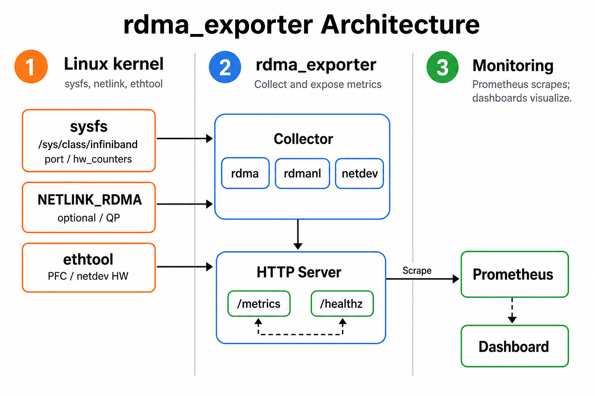

# Prometheus RDMA Exporter

[](LICENSE)
[](https://github.com/yuuki/rdma_exporter/actions/workflows/ci.yml)
[](https://github.com/yuuki/rdma_exporter/releases)
[](https://pkg.go.dev/github.com/yuuki/rdma_exporter)

For details on GitHub Actions status badges, see the [official documentation](https://docs.github.com/ja/actions/how-tos/monitor-workflows/add-a-status-badge).

`rdma_exporter` collects RDMA (InfiniBand/RoCE) NIC statistics from Linux hosts and exposes them as Prometheus metrics. The exporter walks the kernel's sysfs tree directly and publishes metrics with [`github.com/prometheus/client_golang`](https://pkg.go.dev/github.com/prometheus/client_golang).

## Overview



## Features
- Publishes counters from `/sys/class/infiniband/<dev>/<port>/counters` and `/hw_counters` as `rdma_<counter>_total` metrics that match NVIDIA's *Understanding mlx5 Linux Counters and Status Parameters* guide (e.g. `rdma_port_rcv_data_total`, `rdma_symbol_error_total`, `rdma_duplicate_request_total`). The sysfs `lifespan` knob is exported as the gauge `rdma_lifespan_milliseconds`, not as a `_total` counter.
- Exposes port metadata (link layer, state, width, speed, PCI address, VF/PF relationship, etc.) through `rdma_port_info`.
- Tracks scrape failures with `rdma_scrape_errors_total`.
- **Supports device exclusion** (`--exclude-devices`) to prevent kernel log flooding on firmware-restricted devices (NVIDIA DGX, Umbriel, GB200 systems).
- Ships with an HTTP server that serves `/metrics` and `/healthz` and gracefully shuts down on `SIGINT`/`SIGTERM`.
- Supports an alternative sysfs root (`--sysfs-root`) for testing or chroot environments.
- Honors a configurable scrape timeout (`--scrape-timeout`) to protect long-running sysfs reads.
- Optionally enriches RoCEv2 visibility with PFC counters from netdev ethtool stats (Linux only, best effort).
- Optionally exports mlx5 ethtool hardware counters for NIC buffer drops, PCIe stalls, PHY/FEC, IEEE 802.3x global pause, and pause storm (opt-in, `--enable-netdev-hw-metrics`).
- Optionally exports mlx5 congestion-control counters (`cc_*`) that sysfs omits, via RDMA netlink (`--enable-rdma-optional-counters`). The exporter never enables counters.
- Optionally exports live auto-type QP hardware counters (`rdma_qp_*`) via a separate RDMA netlink socket (`--enable-rdma-qp-counters`). The exporter never binds QPs or enables auto mode.

## Requirements
- Go 1.26.6 or newer.
- Linux with read access to `/sys/class/infiniband` (for production use).

## Build
```bash
go build -o rdma_exporter .
```

Alternatively, use the provided `Makefile` helpers:

```bash
make build   # compiles ./rdma_exporter
make test    # runs go test ./...
make lint    # runs go vet ./...
```

## Run
```bash
./rdma_exporter \
  --listen-address=":9879" \
  --metrics-path="/metrics" \
  --health-path="/healthz"
```

To exclude specific devices that trigger firmware errors (e.g., on NVIDIA DGX/GB200 systems):
```bash
./rdma_exporter --exclude-devices=mlx5_0,mlx5_1
```

Optional mlx5 congestion-control counters (`cc_*`) are omitted from sysfs. They are **disabled by default** and `rdma statistic set` is **not persistent**: enablement lives in the in-kernel `rdma_hw_stats` bitmap (and, on mlx5, in flow-steering rules created at enable time). A reboot, `mlx5_ib` reload, or device unbind/rebind returns them to disabled. There is no sysfs, module parameter, or `mlxconfig` knob. Reading them needs Linux 5.16+ (`STAT_GET_STATUS`). The exporter never calls `rdma statistic set`.

`rdma statistic set link DEV/PORT optional-counters A,B` **replaces** the enabled set. Counters not listed are disabled, including other mlx5 optional counters such as `rdma_rx_packets` / `rdma_tx_bytes`. Enabling optional counters allocates mlx5 flow counters and steering rules and may affect datapath performance; measure before leaving them on fleet-wide.

Enable once (`CAP_NET_ADMIN`), then scrape. Confirm with `rdma statistic mode` before trusting `/metrics`:
```bash
rdma statistic mode supported link mlx5_0/1
sudo rdma statistic set link mlx5_0/1 optional-counters cc_rx_ce_pkts,cc_rx_cnp_pkts,cc_tx_cnp_pkts
rdma statistic mode link mlx5_0/1
./rdma_exporter --enable-rdma-optional-counters
```

To re-apply after boot or hotplug, use a root oneshot (not the `rdma_exporter` user). This example **owns** the complete optional-counter set as the three `cc_*` names; include any other optional counters you must keep in the same `set` line. Skip ports that do not advertise `cc_*`, and do not hide `set` failures:

```bash
#!/bin/sh
set -eu
counters=cc_rx_ce_pkts,cc_rx_cnp_pkts,cc_tx_cnp_pkts
status=0
for port_dir in /sys/class/infiniband/*/ports/*; do
  [ -d "$port_dir" ] || continue
  dev=$(basename "$(dirname "$(dirname "$port_dir")")")
  port=$(basename "$port_dir")
  link="$dev/$port"
  if ! rdma statistic mode supported link "$link" | grep -q cc_rx_ce_pkts; then
    continue
  fi
  rdma statistic set link "$link" optional-counters "$counters" || status=1
done
exit "$status"
```

Install it as `/usr/local/sbin/rdma-enable-optional-counters` and hook it like other RDMA user services ([rdma-core udev.md](https://github.com/linux-rdma/rdma-core/blob/master/Documentation/udev.md)). Do not use udev `RUN+=` (it blocks the udev queue). Activate a oneshot via systemd:

```ini
# /etc/systemd/system/rdma-optional-counters.service
[Unit]
Description=Enable mlx5 optional RDMA hardware counters
Documentation=man:rdma-statistic(8)
After=rdma-hw.target

[Service]
Type=oneshot
ExecStart=/usr/local/sbin/rdma-enable-optional-counters

[Install]
WantedBy=rdma-hw.target
```

```
# /etc/udev/rules.d/90-rdma-optional-counters.rules
ACTION=="add", SUBSYSTEM=="infiniband", TAG+="systemd", ENV{SYSTEMD_WANTS}="rdma-optional-counters.service"
```

```bash
sudo systemctl daemon-reload
sudo systemctl enable rdma-optional-counters.service
```

`enable` without `--now` lets the first hardware appearance start `rdma-hw.target`. `SYSTEMD_WANTS` re-runs the oneshot on later `add` events (VF, driver reload). If `rdma-hw.target` is absent, use `After=network-online.target` and `WantedBy=multi-user.target`, and keep the udev rule for hotplug. After applying, `rdma statistic mode` should list the intended Optional-set.

Live QP statistic sets are a different path. The kernel's sysfs `hw_counters` already include the default pool plus every running allocated set plus history. A QP dump is only the sets currently bound; **do not add** `rdma_qp_*_total` to `rdma_<name>_total`. Auto mode applies to **new user QPs that go RST→INIT after enablement**; existing QPs and kernel QPs stay on the default pool. Enable auto type **before** the workload creates QPs (`CAP_NET_ADMIN`). `STAT_GET` / dump is unprivileged. The exporter never issues `STAT_SET`, bind, unbind, or `qp set auto`.

`auto pid` and manual per-QP sets are visible on mode/mask gauges only; their values are not exported. Optional traffic counters (`rdma_rx_bytes`, `rdma_tx_bytes`, `rdma_rx_packets`, `rdma_tx_packets`) are exported from the same auto-type dump as `rdma_qp_rx_bytes_total` (and the tx/packets analogues). They appear only when the dump contains those keys. The exporter never enables them.

Port-level `--enable-rdma-optional-counters` still emits `_total` only for `cc_*`. `rdma_optional_counter_enabled` continues to cover every optional name, including traffic counters that are on at the port but not yet on the QP set.

```bash
sudo rdma statistic qp set link mlx5_0/1 auto type on
./rdma_exporter --enable-rdma-qp-counters
```

Optional traffic uses the same exporter flag. The dump keys appear only after the operator enables the names in the port optional-set (`set` replaces the whole list) and turns QP `optional-counters on` (mlx5, Linux 6.15+), **before** user QPs go INIT:

```bash
sudo rdma statistic set link mlx5_0/1 optional-counters cc_rx_ce_pkts,cc_rx_cnp_pkts,cc_tx_cnp_pkts,rdma_rx_bytes,rdma_tx_bytes,rdma_rx_packets,rdma_tx_packets
sudo rdma statistic qp set link mlx5_0/1 auto type on optional-counters on
```

Re-apply after boot, driver reload, or VF hotplug with the same systemd oneshot + udev `SYSTEMD_WANTS` pattern as optional counters (`After=rdma-hw.target`; do not use udev `RUN+=`). Enablement is not persistent. Start the oneshot before RDMA applications.

Some mlx5 QP counters are 32-bit and can wrap. Prefer short `rate()` windows (on the order of the scrape interval) rather than long-range `increase()`.

To print build information without starting the server, add `--version`.

## Configuration
Every CLI flag has an equivalent environment variable. Environment values provide defaults; explicit CLI flags take precedence.

| Flag | Environment | Default | Description |
| ---- | ----------- | ------- | ----------- |
| `--listen-address` | `RDMA_EXPORTER_LISTEN_ADDRESS` | `:9879` | HTTP listen address |
| `--metrics-path` | `RDMA_EXPORTER_METRICS_PATH` | `/metrics` | Metrics endpoint path |
| `--health-path` | `RDMA_EXPORTER_HEALTH_PATH` | `/healthz` | Health check endpoint path |
| `--log-level` | `RDMA_EXPORTER_LOG_LEVEL` | `info` | Log verbosity (`debug`, `info`, `warn`, `error`) |
| `--sysfs-root` | `RDMA_EXPORTER_SYSFS_ROOT` | `/sys` | Root directory used to read RDMA sysfs data |
| `--scrape-timeout` | `RDMA_EXPORTER_SCRAPE_TIMEOUT` | `5s` | Upper bound for metric gathering per scrape |
| `--enable-roce-pfc-metrics` | `RDMA_EXPORTER_ENABLE_ROCE_PFC_METRICS` | `true` | Enable RoCEv2 PFC metric collection from netdev ethtool stats (Linux only). Does not enable buffer/PCIe/PHY, global pause, or pause-storm counters. |
| `--enable-netdev-hw-metrics` | `RDMA_EXPORTER_ENABLE_NETDEV_HW_METRICS` | `false` | Enable ethtool hardware counters for NIC buffer drops, PCIe stalls, PHY/FEC, IEEE 802.3x global pause, and pause storm (Linux only, opt-in). |
| `--enable-rdma-optional-counters` | `RDMA_EXPORTER_ENABLE_RDMA_OPTIONAL_COUNTERS` | `false` | Enable optional RDMA hardware counters (Linux only, NETLINK_RDMA). The exporter never turns counters on. |
| `--enable-rdma-qp-counters` | `RDMA_EXPORTER_ENABLE_RDMA_QP_COUNTERS` | `false` | Enable live auto-type QP counters (Linux only, separate NETLINK_RDMA socket). The exporter never binds QPs or enables auto mode. |
| `--exclude-devices` | `RDMA_EXPORTER_EXCLUDE_DEVICES` | `` | Comma-separated list of RDMA devices to exclude (e.g., `mlx5_0,mlx5_1`) |

## Metrics
- `rdma_<counter>_total{device,port}` – Port and hardware counters aligned with NVIDIA documentation (e.g. `rdma_port_rcv_data_total`, `rdma_symbol_error_total`, `rdma_duplicate_request_total`).
- `rdma_lifespan_milliseconds{device,port}` – Gauge of the sysfs `hw_counters/lifespan` update period in **milliseconds** (kernel default 10, writable range 0–10000). Not a cumulative counter; do not `rate()` it. Replaces the former mis-typed `rdma_lifespan_total`. The exporter does not write this file.
- `rdma_port_info{device,port,link_layer,state,phys_state,link_width,link_speed,pci_addr,is_vf,pf_device}` – Gauge set to `1` with descriptive labels. `pci_addr` carries the device's PCI address (e.g. `0000:1a:00.0`); `is_vf` is `"true"` for SR-IOV virtual functions; `pf_device` names the parent PF IB device when `is_vf="true"` (empty otherwise). These enable joins with external sources keyed by PCI address (e.g. `sriov_kubepoddevice`) for per-VF/per-pod RDMA bandwidth attribution.
- `rdma_scrape_errors_total{}` – Counter incremented when sysfs collection fails.
- `rdma_roce_pfc_pause_frames_total{device,port,netdev,direction,priority}` – RoCEv2 PFC pause frames from ethtool stats.
- `rdma_roce_pfc_pause_duration_total{device,port,netdev,direction,priority}` – Cumulative PFC pause duration in **microseconds**. Occupancy is `rate(...[$interval]) / 1e6`.
- `rdma_roce_pfc_pause_transitions_total{device,port,netdev,direction,priority}` – PFC XOFF-to-XON transitions (mlx5 exposes receive/`rx` only).
- `rdma_roce_pfc_scrape_errors_total{}` – Counter incremented when PFC ethtool collection fails.
- `rdma_netdev_*` / `rdma_pcie_*` / `rdma_phy_*` – Opt-in ethtool hardware counters (`--enable-netdev-hw-metrics`). See below.
- `rdma_netdev_scrape_errors_total{}` – Counter incremented when netdev hardware ethtool collection fails.
- `rdma_optional_counter_enabled{device,port,counter}` – Gauge (`1`/`0`) for each optional hardware counter advertised by `rdma statistic mode`. Opt-in (`--enable-rdma-optional-counters`, Linux 5.16+).
- `rdma_optional_counter_scrape_errors_total{}` – Counter incremented when optional-counter netlink collection fails, including an enabled counter whose value was missing in the same scrape.
- `rdma_cc_rx_ce_pkts_total`, `rdma_cc_rx_cnp_pkts_total`, `rdma_cc_tx_cnp_pkts_total` – Optional mlx5 congestion-control counters from RDMA netlink. These never appear in sysfs `hw_counters` (`IB_STAT_FLAG_OPTIONAL`). They are distinct from the always-on NP/RP counters (`rdma_np_*`, `rdma_rp_*`). Values are emitted only for these three names, and only while the counter is enabled and a value was read. Other optional names (for example `rdma_rx_packets`) appear on `rdma_optional_counter_enabled`. Live auto-type QP dumps may also export them as `rdma_qp_rx_packets_total` when `--enable-rdma-qp-counters` is on and the dump contains the key.
- `rdma_qp_counter_mode{device,port,mode}` / `rdma_qp_auto_mask{device,port,criteria}` – Port-level QP bind mode and auto mask (`none|auto|manual`, `type|pid`). Opt-in (`--enable-rdma-qp-counters`). Empty dumps still emit these when mode is auto and no user QP has gone INIT yet.
- `rdma_qp_scrape_status{device,port,result}` – `ok`, `overflow`, or `error` for the last QP dump on that port. Overflow drops totals for that port only; other ports and `cc_*` continue.
- `rdma_qp_scrape_errors_total{}` – Counter incremented on QP netlink failures, including dump overflow.
- `rdma_qp_<name>_total{device,port,qp_type}` – Live auto-type bound user QP aggregate (`duplicate_request`, `implied_nak_seq_err`, `local_ack_timeout_err`, `packet_seq_err`, `rnr_nak_retry_err`, `out_of_buffer`, `rx_write_requests`, `rx_read_requests`, `rx_atomic_requests`, plus optional `rx_bytes` / `tx_bytes` / `rx_packets` / `tx_packets` from dump keys `rdma_*`). Not per-LQPN. Do not add these to the same-named sysfs `rdma_<name>_total` series. Optional traffic series are omitted unless the dump contains those keys; dump key `rdma_rx_bytes` becomes `rdma_qp_rx_bytes_total`, not `rdma_qp_rdma_rx_bytes_total`.

See the [Run](#run) section for operator enablement (`rdma statistic set` / `rdma statistic qp set auto type on`).

The Go and process collectors from `client_golang` are registered automatically.

PFC and ethtool hardware metrics are collected only for Ethernet physical functions. Physical-port counters on a PF include VF traffic. Series are emitted only for counters the driver actually returns; missing priorities do not mean “zero pauses”.

### PFC direction

These are observations, not root-cause labels:

- `direction="rx"`: the peer XOFFed this NIC, so this NIC cannot transmit on that priority.
- `direction="tx"`: this NIC XOFFed the peer because it is not absorbing that priority.

Treat a sustained `rx` pause as a reason to inspect the network path, and a sustained `tx` pause as a reason to inspect NIC receive buffers, PCIe, and the host. Do not read `tx` pause as switch congestion.

Pause occupancy:

```promql
rate(rdma_roce_pfc_pause_duration_total[$interval]) / 1e6
```

### Netdev hardware counters (opt-in)

Enable with `--enable-netdev-hw-metrics`. These are mlx5 netdev/device statistics correlated to an RDMA port via `netdev`; they are not RoCE-only.

- Buffer/drop: `rdma_netdev_prio_buf_discard_total`, `rdma_netdev_prio_cong_discard_total`, `rdma_netdev_prio_discards_total`, `rdma_netdev_prio_ecn_marked_total`, `rdma_netdev_dev_out_of_buffer_total`, `rdma_netdev_rx_out_of_buffer_total`, `rdma_netdev_rx_discards_phy_total`. Distinct from the sysfs QP WQE counter `rdma_out_of_buffer_total`.
- PCIe: `rdma_pcie_outbound_stalled_percent` is a **gauge** of the last 1 second (kernel 0–100) and can miss stalls shorter than the scrape interval. Alert on `rate(rdma_pcie_outbound_stalled_seconds_total[$interval])`, the fraction of time stall exceeded 30%. Also `rdma_pcie_outbound_buffer_overflow_total` and `rdma_pcie_signal_integrity_total`.
- PHY/FEC: `rdma_phy_rx_corrected_bits_total`, `rdma_phy_rx_pcs_symbol_err_total`, `rdma_phy_rx_bits_total`, `rdma_phy_rx_err_lane_total`, `rdma_phy_rx_crc_errors_total`, `rdma_phy_link_down_events_total`.
- IEEE 802.3x global pause (not PFC; keys exist only when global pause mode is on): `rdma_netdev_global_pause_frames_total{device,port,netdev,direction}`, `rdma_netdev_global_pause_duration_total` (microseconds; occupancy is `rate()/1e6`), `rdma_netdev_global_pause_transitions_total` (mlx5 receive/`rx` only). Direction is observation only: `rx` means this NIC received a pause request (was asked to stop transmitting); `tx` means this NIC transmitted a pause request (asked the peer to stop). Do not treat as root cause.
- Pause storm: `rdma_netdev_pause_storm_events_total{device,port,netdev,severity}`. `warning` is stalled past a watermark; `error` is timeout and pause TX disabled (drops may have occurred). Observation only; do not assert root cause.

Interval FEC/BER ratio (not a lifetime or instantaneous instrument):

```promql
increase(rdma_phy_rx_corrected_bits_total[$interval])
  /
clamp_min(increase(rdma_phy_rx_bits_total[$interval]), 1)
```

Use the same form with `rdma_phy_rx_pcs_symbol_err_total` for uncorrected symbol errors.

Enabling these counters adds one series per present allowlisted ethtool key (not a full `ethtool -S` dump). Disable with `--enable-netdev-hw-metrics=false`.

### RoCEv2 congestion control

Default sysfs `hw_counters` already export Notification Point / Reaction Point counters (`rdma_np_cnp_sent_total`, `rdma_np_ecn_marked_roce_packets_total`, `rdma_rp_cnp_handled_total`, `rdma_rp_cnp_ignored_total`). mlx5 optional counters (`cc_rx_ce_pkts`, `cc_rx_cnp_pkts`, `cc_tx_cnp_pkts`) are **not** in sysfs even when enabled with `rdma statistic set`; scrape them with `--enable-rdma-optional-counters` as described in [Run](#run).

## Dashboards
- Bundled JSON: [`dashboards/rdma_exporter_dashboard.json`](dashboards/rdma_exporter_dashboard.json) includes PFC occupancy, PCIe stall, and PHY/FEC panels. PCIe/PHY panels need `--enable-netdev-hw-metrics`. Global pause and pause storm are scraped with the same flag but are not on the bundled dashboard yet.
- Grafana.com: [RDMA/RoCE NIC Telemetry](https://grafana.com/grafana/dashboards/24241-rdma-roce-nic-telemetry/) – community copy; updating that listing is a separate publish step.

## Testing
```bash
go test ./...
```

For deterministic builds in shared environments, you can pin Go's caches locally:

```bash
GOCACHE=$(pwd)/.gocache GOMODCACHE=$(pwd)/.gomodcache go test ./...
```

`internal/rdma/testdata/sysfs` contains fixture trees used in unit tests to emulate sysfs layouts.

## Deployment
- A systemd unit file is available under `deploy/systemd/rdma_exporter.service`.
- A multi-stage Dockerfile lives at the repository root; see `docs/deployment.md` for build and run instructions.

## Development Notes
- Architectural decisions and future work are documented in `docs/design.md`.
- Logging uses the Go standard library `log/slog`. Set `--log-level=debug` for detailed scrape traces.
- Deployment guidance (systemd and container) lives in `docs/deployment.md`.

## License
This project is licensed under the MIT License. See `LICENSE` for full text.
